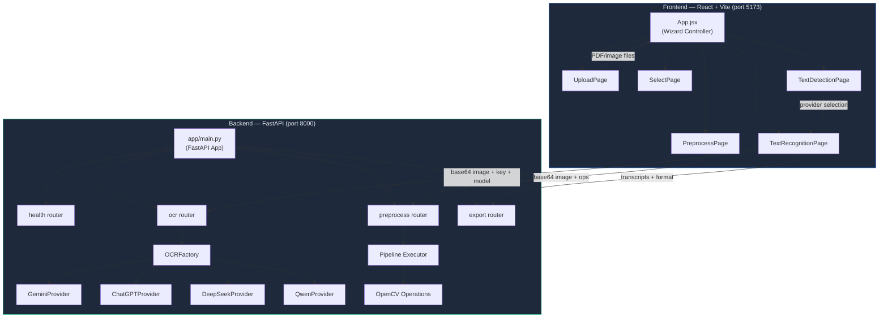
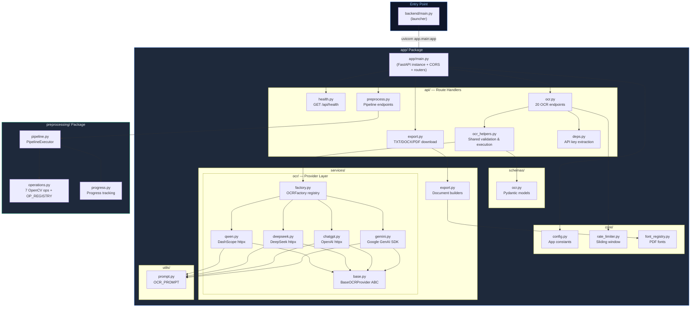
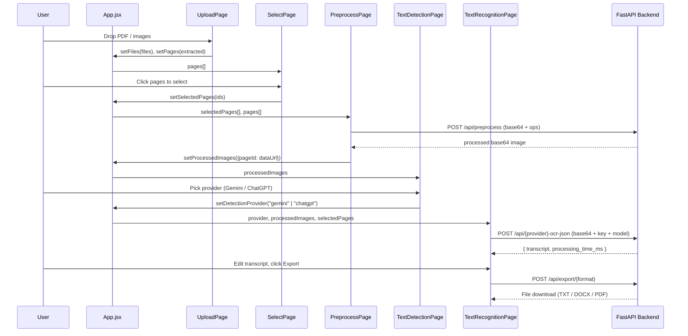

# RenAIssance — OCR Preprocessing Studio

A full-stack web application for preprocessing historical documents and extracting text using multiple AI providers. Built with **React + Vite + Tailwind CSS** on the frontend and **FastAPI + OpenCV** on the backend.

     

---

## 🎯 Features

- **PDF & Image Upload** — Drag-and-drop for PDFs and image files (PNG, JPG, TIFF, BMP)
- **Smart Page Selection** — Preview all pages, click/shift-click to select, auto double-page split
- **Image Preprocessing** — 7 OpenCV operations (normalize, grayscale, deskew, denoise, contrast, sharpen, binarize) with real-time before/after comparison
- **Multi-Provider OCR** — Choose between **Gemini** (Google) and **ChatGPT** (OpenAI) for text extraction
- **Transcript Editing** — Edit extracted text with OCR marker highlighting (`[illegible]`, `[unclear]`)
- **Multi-Format Export** — Download combined transcripts as TXT, DOCX, or PDF with Unicode support
- **Rate Limiting** — Sliding-window limiter for Gemini free tier (5 req / 60 s) with batch processing (4 pages/batch)

---

## 🏗️ High-Level Architecture



---

## 🔄 Application Flow

The app follows a **5-step wizard** pattern. Steps 3 and 5 take over the full viewport; the others use a standard layout with a header and stepper.


| Step | Page Component | What Happens |
|------|---------------|--------------|
| **1. Upload** | `UploadPage` | User drops PDF/images → `usePdfPreview` hook renders pages via PDF.js, auto-splits double-page spreads |
| **2. Select** | `SelectPage` | Thumbnail grid with click/shift-click selection. Skipped for single images |
| **3. Preprocess** | `PreprocessPage` | Full-screen 3-panel layout. Left: operation sidebar + pipeline stack. Center: before/after zoom viewer with crop tool. Right: page thumbnails. All processing sent to backend OpenCV pipeline |
| **4. Detect** | `TextDetectionPage` | Provider cards (Gemini ✅, ChatGPT ✅, DeepSeek 🚫, Qwen 🚫). User picks a provider |
| **5. OCR** | `TextRecognitionPage` | Full-screen 3-column workspace. Left: API key + model config + page list. Center: image preview with zoom/pan. Right: editable transcript. Supports single-page, batch, and auto-processing. Export to TXT/DOCX/PDF |

---

## 📁 Repository Structure

```
RenAIssance/
├── .env                            # API keys (entered in UI, not auto-read)
├── README.md
│
├── backend/                        # ── FastAPI Backend ──────────────────
│   ├── main.py                     # Thin launcher → runs app.main:app via Uvicorn
│   ├── requirements.txt            # Python dependencies
│   │
│   ├── app/                        # Main application package
│   │   ├── __init__.py
│   │   ├── main.py                 # FastAPI app creation, CORS, router registration
│   │   │
│   │   ├── core/                   # Cross-cutting concerns
│   │   │   ├── config.py           # App constants (title, version, CORS, limits)
│   │   │   ├── rate_limiter.py     # Sliding-window rate limiter (5 req / 60 s)
│   │   │   └── font_registry.py    # DejaVu font registration for PDF Unicode export
│   │   │
│   │   ├── api/                    # Route handlers (thin controllers)
│   │   │   ├── health.py           # GET /api/health
│   │   │   ├── ocr.py              # All OCR endpoints (models, validate, transcribe)
│   │   │   ├── ocr_helpers.py      # Shared logic: parse images, validate, run OCR
│   │   │   ├── preprocess.py       # Preprocessing endpoints (operations, pipeline)
│   │   │   ├── export.py           # Export endpoints (TXT, DOCX, PDF)
│   │   │   └── deps.py             # Dependency injection (API key extraction)
│   │   │
│   │   ├── schemas/                # Pydantic request/response models
│   │   │   └── ocr.py              # GeminiOCRRequest, ChatGPTOCRRequest, etc.
│   │   │
│   │   ├── services/               # Business logic
│   │   │   ├── export.py           # Document builders (TXT, DOCX, PDF)
│   │   │   └── ocr/                # OCR provider implementations
│   │   │       ├── base.py         # BaseOCRProvider (ABC) — transcribe() contract
│   │   │       ├── factory.py      # OCRFactory — provider registry & instantiation
│   │   │       ├── gemini.py       # Google GenAI SDK integration
│   │   │       ├── chatgpt.py      # OpenAI API via httpx
│   │   │       ├── deepseek.py     # DeepSeek API via httpx
│   │   │       └── qwen.py         # DashScope API via httpx
│   │   │
│   │   └── utils/
│   │       └── prompt.py           # Shared OCR_PROMPT used by all providers
│   │
│   └── preprocessing/              # OpenCV image processing package
│       ├── __init__.py
│       ├── operations.py           # 7 operations + OP_REGISTRY
│       ├── pipeline.py             # PipelineExecutor — runs steps sequentially
│       └── progress.py             # Progress tracking & timing utilities
│
└── frontend/                       # ── React Frontend ───────────────────
    ├── package.json                # Node dependencies (React 18, pdfjs-dist, lucide)
    ├── vite.config.js              # Vite config with PDF.js chunk splitting
    ├── tailwind.config.js          # Tailwind CSS config
    ├── postcss.config.js           # PostCSS config
    ├── index.html                  # HTML entry point
    │
    └── src/
        ├── main.jsx                # React DOM entry point
        ├── App.jsx                 # Root component — 5-step wizard state machine
        ├── index.css               # Global styles, Tailwind directives, animations
        │
        ├── features/               # Feature modules (domain-organised)
        │   ├── upload/             # Step 1 & 2
        │   │   ├── index.js        # Barrel export
        │   │   └── pages/
        │   │       ├── UploadPage.jsx
        │   │       └── SelectPage.jsx
        │   │
        │   ├── preprocess/         # Step 3
        │   │   ├── index.js
        │   │   └── pages/
        │   │       └── PreprocessPage.jsx   # Full-screen 3-panel preprocessor
        │   │
        │   └── ocr/                # Steps 4 & 5
        │       ├── index.js
        │       ├── config/
        │       │   └── providers.js         # Provider metadata, fallback models, METHOD_OPTIONS
        │       ├── pages/
        │       │   ├── TextDetectionPage.jsx    # Provider selection cards
        │       │   └── TextRecognitionPage.jsx  # OCR workspace
        │       └── services/
        │           └── ocrApi.js    # Unified OCR API client for all providers
        │
        ├── components/             # Shared / reusable UI components
        │   ├── Stepper.jsx         # 5-step progress indicator
        │   ├── UploadZone.jsx      # Drag-and-drop file upload
        │   ├── PageCard.jsx        # Page thumbnail card
        │   ├── PdfPreviewGrid.jsx  # Grid of selectable page thumbnails
        │   ├── ImageCompare.jsx    # Before/after slider comparison
        │   ├── ImageCropper.jsx    # Draggable crop tool with aspect lock
        │   ├── ModelSelector.jsx   # Legacy Gemini model selector
        │   ├── TranscriptEditor.jsx # Text editor with OCR markers
        │   ├── CombinedExportPanel.jsx # Export buttons (TXT/DOCX/PDF)
        │   ├── OperationControl.jsx    # Preprocessing operation toggle/slider
        │   │
        │   ├── ocr/                # OCR workspace components
        │   │   ├── OCRLayout.jsx           # 3-column layout wrapper with header
        │   │   ├── SidebarConfig.jsx       # API key + model config panel
        │   │   ├── TranscriptPanel.jsx     # Transcript viewer/editor + export
        │   │   ├── PageThumbnailList.jsx   # Lazy-loaded page thumbnail sidebar
        │   │   ├── PagePreview.jsx         # Center image preview (zoom/pan)
        │   │   ├── PreviewZoomViewer.jsx   # Zoom lens viewer
        │   │   └── ResizablePanels.jsx     # Draggable 3-column splitter
        │   │
        │   └── preprocess/         # Preprocessing UI components
        │       ├── OperationCard.jsx       # Operation enable/disable card
        │       ├── OperationSlider.jsx     # Parameter slider control
        │       ├── OperationsSidebar.jsx   # Left sidebar with all operations
        │       ├── PipelineStack.jsx       # Active pipeline step list
        │       ├── BeforeAfterViewer.jsx   # Full before/after comparison
        │       ├── ZoomLensPreview.jsx     # Magnified region viewer
        │       ├── ProgressBarLabeled.jsx  # Progress bar with label
        │       └── TooltipInfo.jsx         # Info tooltip helper
        │
        ├── config/
        │   └── preprocessOperations.js  # 7 operation definitions with UI controls
        │
        ├── hooks/
        │   ├── usePdfPreview.js    # PDF.js page extraction + double-page splitting
        │   └── usePipeline.js      # Preprocessing pipeline state management
        │
        └── services/
            ├── api.js              # Preprocessing API client (calls backend)
            └── geminiApi.js        # Legacy Gemini-only API client
```

---

## 🔗 How Everything Connects

### Backend Architecture



#### OCR Provider Pattern (Strategy + Factory)

All four providers inherit from `BaseOCRProvider` and implement a single `transcribe()` method. The `OCRFactory` maps string names to provider classes:

```
BaseOCRProvider (ABC)
├── transcribe(api_key, image_bytes, model_name, mime_type) → str   [abstract]
├── MODELS          [class-level list of {id, name, description}]
├── DEFAULT_MODEL   [class-level string]
└── MODEL_IDS       [class-level list of valid model IDs]

OCRFactory._PROVIDERS = {
    "gemini":   GeminiProvider,      # Google GenAI SDK (google.genai)
    "chatgpt":  ChatGPTProvider,     # OpenAI API via httpx
    "deepseek": DeepSeekProvider,    # DeepSeek API via httpx
    "qwen":     QwenProvider,        # DashScope API via httpx
}

OCRFactory.get_provider("gemini")  →  GeminiProvider()
```

All providers share a single `OCR_PROMPT` (from `app/utils/prompt.py`) — a detailed instruction set for high-accuracy transcription that handles multi-column layouts, marginal notes, original spelling preservation, and `[illegible]` markers.

The `ocr_helpers.py` module centralises shared endpoint logic so all route handlers are thin wrappers:

| Helper Function | Purpose |
|----------------|---------|
| `parse_base64_image()` | Decode base64 data URL → raw bytes + MIME type |
| `validate_model()` | Check model ID against provider's allowed list |
| `validate_api_key_format()` | Minimum length check |
| `check_rate_limit()` | Query sliding-window limiter (Gemini only) |
| `run_ocr()` | Call `provider.transcribe()`, handle errors, return `OCRResponse` |

#### Preprocessing Pipeline

```
Client sends: { image_data: "data:image/png;base64,...", operations: [...], preview_mode: false }
        │
        ▼
  preprocess.py (router) — decode base64 → numpy array
        │
        ▼
  pipeline.py — PipelineExecutor.execute(image, steps)
        │   for each enabled step:
        │       OP_REGISTRY[step.op](image, params, progress_callback)
        ▼
  operations.py — 7 OpenCV functions:
        │   normalize  → histogram stretching
        │   grayscale  → BGR → gray
        │   deskew     → contour + Hough line detection + rotation
        │   denoise    → NLM / bilateral / Gaussian
        │   contrast   → CLAHE adaptive histogram equalization
        │   sharpen    → unsharp mask
        │   threshold  → Otsu / adaptive / Sauvola binarization
        ▼
  Result encoded back to base64 data URL → JSON response
```

#### Export Pipeline

```
TranscriptPanel → ocrApi.exportTranscripts(transcripts, format)
    → POST /api/export/{txt|docx|pdf}
    → export router → export service:
        build_txt_export()   → UTF-8 BOM plain text with page separators
        build_docx_export()  → python-docx Document with headings & page breaks
        build_pdf_export()   → ReportLab PDF with DejaVu Sans Unicode font
    → StreamingResponse with Content-Disposition
    → Browser downloads file
```

---

### Frontend Architecture

```mermaid
flowchart TD
    subgraph Root["Entry"]
        MJ["main.jsx\nReactDOM.render"]
    end

    subgraph AppWizard["App.jsx — Wizard State Machine"]
        direction TB
        ST["State: step, files, selectedPages,\nprocessedImages, detectionProvider"]
    end

    subgraph Features["features/ — Domain Modules"]
        subgraph Upload["upload/"]
            UP["UploadPage.jsx"]
            SP["SelectPage.jsx"]
        end
        subgraph Preprocess["preprocess/"]
            PPG["PreprocessPage.jsx\n(full-screen, 3-panel)"]
        end
        subgraph OCRFeature["ocr/"]
            PROV["providers.js\nProvider config"]
            TDP["TextDetectionPage.jsx\nProvider selection"]
            TRP["TextRecognitionPage.jsx\nOCR workspace"]
            OAPI["ocrApi.js\nUnified API client"]
        end
    end

    subgraph Components["components/ — Shared UI"]
        STEP["Stepper.jsx"]
        UZ["UploadZone.jsx"]
        IC["ImageCropper.jsx"]

        subgraph OCRComp["ocr/"]
            OL["OCRLayout.jsx\n3-column layout"]
            SC["SidebarConfig.jsx\nAPI key + model"]
            TP["TranscriptPanel.jsx\nEditor + export"]
            PTL["PageThumbnailList.jsx"]
            PP2["PagePreview.jsx\nZoom/pan viewer"]
            RP["ResizablePanels.jsx"]
        end

        subgraph PrepComp["preprocess/"]
            OS["OperationsSidebar"]
            PS["PipelineStack"]
            BAV["BeforeAfterViewer"]
            ZL["ZoomLensPreview"]
        end
    end

    subgraph Hooks["hooks/"]
        PDF["usePdfPreview.js\nPDF.js extraction"]
        PIPE["usePipeline.js\nPipeline state"]
    end

    subgraph ServicesF["services/"]
        API["api.js\nPreprocess API client"]
    end

    MJ --> AppWizard
    AppWizard --> UP & SP & PPG & TDP & TRP
    UP --> UZ
    UP --> PDF
    PPG --> OS & PS & BAV & ZL & IC & PIPE
    PIPE --> API
    TDP --> PROV
    TRP --> OL
    OL --> SC & TP & PTL & PP2 & RP
    TRP --> OAPI

    style Root fill:#0f172a,stroke:#6366f1,color:#c7d2fe
    style AppWizard fill:#1e293b,stroke:#6366f1,color:#e2e8f0
    style Features fill:#1e293b,stroke:#3b82f6,color:#e2e8f0
    style Components fill:#1e293b,stroke:#8b5cf6,color:#e2e8f0
```



#### Data Flow Through the Wizard



#### Component Hierarchy for OCR Workspace (Step 5)

```
TextRecognitionPage (state: apiKey, model, transcripts, zoom, autoProcess…)
└── OCRLayout (3-column frame with header + progress bar)
    ├── Left Column
    │   ├── SidebarConfig (API key input, model dropdown, batch size)
    │   └── PageThumbnailList (lazy-loaded thumbnails, status indicators)
    ├── Center Column
    │   └── PagePreview (zoomable/pannable image, process button, auto-process toggle)
    └── Right Column
        └── TranscriptPanel (edit/view modes, OCR markers, copy, reset, export)
```

---

## 🌐 API Endpoints Reference

### Health & Status

| Method | Endpoint | Description |
|--------|----------|-------------|
| GET | `/api/health` | Health check |
| GET | `/api/rate-limit-status` | Gemini rate limiter status (slots remaining, reset time) |

### Model Discovery

| Method | Endpoint | Description |
|--------|----------|-------------|
| GET | `/api/models` | List Gemini models |
| GET | `/api/chatgpt-models` | List ChatGPT models |
| GET | `/api/deepseek-models` | List DeepSeek models |
| GET | `/api/qwen-models` | List Qwen models |

### OCR Processing

| Method | Endpoint | Provider | Description |
|--------|----------|----------|-------------|
| POST | `/api/validate-key` | Gemini | Validate Gemini API key |
| POST | `/api/gemini-ocr-json` | Gemini | Single page OCR (JSON body) |
| POST | `/api/gemini-ocr-base64` | Gemini | Single page OCR (base64 body) |
| POST | `/api/gemini-ocr-page` | Gemini | Single page OCR (file upload) |
| POST | `/api/gemini-ocr-batch` | Gemini | Batch OCR (up to 4 pages) |
| POST | `/api/chatgpt-ocr-json` | ChatGPT | Single page OCR |
| POST | `/api/deepseek-ocr-json` | DeepSeek | Single page OCR |
| POST | `/api/qwen-ocr-json` | Qwen | Single page OCR |

### Preprocessing

| Method | Endpoint | Description |
|--------|----------|-------------|
| GET | `/api/preprocess/operations` | List available operations with descriptions |
| POST | `/api/preprocess` | Apply preprocessing pipeline to image |
| POST | `/api/preprocess/validate` | Validate pipeline configuration |

### Export

| Method | Endpoint | Description |
|--------|----------|-------------|
| POST | `/api/export/txt` | Export combined transcript as UTF-8 TXT |
| POST | `/api/export/docx` | Export as Word document |
| POST | `/api/export/pdf` | Export as PDF with Unicode support |

---

## ⚙️ Available AI Models

### Gemini (Google) — ✅ Recommended

| Model | Description |
|-------|-------------|
| `gemini-3-flash-preview` | Latest and fastest **(default)** |
| `gemini-3-pro-preview` | Most capable preview model |
| `gemini-2.5-pro` | Stable pro model |
| `gemini-2.5-flash` | Stable flash model |

### ChatGPT (OpenAI) — ✅ Supported

| Model | Description |
|-------|-------------|
| `gpt-5.2` | Latest and most capable multimodal model **(default)** |
| `gpt-5-mini` | Smaller, faster, and more affordable |

### DeepSeek — 🚫 Unavailable

> Does not provide API support for images. Card is disabled in the UI.

### Qwen — 🚫 Unavailable

> Does not provide API support for images. Card is disabled in the UI.

---

## 🔧 Preprocessing Operations

| Operation | Description | Key Parameters |
|-----------|-------------|----------------|
| **Normalize** | Histogram stretching for brightness/contrast | `strength` (0–100) |
| **Grayscale** | BGR → grayscale conversion | — |
| **Deskew** | Auto-correct page rotation via Hough lines | `maxAngle` (1–45°) |
| **Denoise** | Noise removal preserving text edges | `method` (nlm / bilateral / gaussian), `strength` (1–20) |
| **Contrast** | CLAHE adaptive histogram equalization | `clipLimit` (1–10), `tileSize` (2–16) |
| **Sharpen** | Unsharp mask sharpening | `amount` (0–100%), `radius` (0.5–3 px) |
| **Binarize** | Black/white conversion | `method` (otsu / adaptive / sauvola), `blockSize`, `k` |

### Pipeline Configuration Example

```json
{
  "image_data": "data:image/png;base64,...",
  "operations": [
    { "op": "grayscale", "params": {}, "enabled": true },
    { "op": "deskew", "params": { "maxAngle": 15 }, "enabled": true },
    { "op": "denoise", "params": { "method": "nlm", "strength": 10 }, "enabled": true },
    { "op": "contrast", "params": { "clipLimit": 2, "tileSize": 8 }, "enabled": true },
    { "op": "threshold", "params": { "method": "otsu" }, "enabled": true }
  ],
  "preview_mode": false
}
```

---

## 🚀 Getting Started

### Prerequisites

- **Node.js** ≥ 18.x
- **Python** ≥ 3.10
- **npm** or **yarn**
- A **Gemini API Key** ([Google AI Studio](https://aistudio.google.com/app/apikey)) or **OpenAI API Key** ([OpenAI Platform](https://platform.openai.com/api-keys))

### Installation

```bash
# 1. Clone the repository
git clone https://github.com/sarthakg004/RenAIssanceOCR.git
cd RenAIssance

# 2. Backend setup
cd backend
python -m venv venv
source venv/bin/activate        # Windows: venv\Scripts\activate
pip install -r requirements.txt

# 3. Frontend setup
cd ../frontend
npm install
```

### Running the Application

**Terminal 1 — Backend (port 8000):**

```bash
cd backend
python -m uvicorn app.main:app --host 0.0.0.0 --port 8000
```

**Terminal 2 — Frontend (port 5173):**

```bash
cd frontend
npm run dev
```

Open **http://localhost:5173** in your browser.

> **Note:** API keys are entered in the UI at Step 5, not read from the `.env` file.

---

## 📝 Rate Limiting

The backend enforces a **sliding-window rate limiter** for Gemini free-tier compliance:

- **5 requests per 60-second window**
- Batch processing sends **up to 4 pages** in parallel, consuming 4 slots
- The frontend polls `/api/rate-limit-status` and shows a countdown timer when rate-limited
- Non-Gemini providers (ChatGPT) have no server-side rate limiting

---

## 🛠️ Tech Stack

| Layer | Technology | Purpose |
|-------|-----------|---------|
| **Frontend** | React 18 | UI framework |
| | Vite 5 | Build tool & dev server |
| | Tailwind CSS 3 | Utility-first styling |
| | PDF.js 4 | Client-side PDF rendering |
| | Lucide React | Icon library |
| **Backend** | FastAPI 0.109 | REST API framework |
| | Uvicorn | ASGI server |
| | OpenCV 4 | Image preprocessing |
| | NumPy | Numerical operations |
| | Google GenAI SDK | Gemini API client |
| | httpx | HTTP client for OpenAI / DeepSeek / Qwen APIs |
| | python-docx | Word document generation |
| | ReportLab | PDF generation |
| | Pillow | Image format handling |

---

## 🧩 Adding a New OCR Provider

1. **Create a provider class** in `backend/app/services/ocr/`:

```python
# my_provider.py
from .base import BaseOCRProvider
from ...utils.prompt import OCR_PROMPT

MY_MODELS = [
    {"id": "my-model-v1", "name": "My Model V1", "description": "..."}
]

class MyProvider(BaseOCRProvider):
    MODELS = MY_MODELS
    DEFAULT_MODEL = "my-model-v1"
    MODEL_IDS = [m["id"] for m in MY_MODELS]

    def transcribe(self, api_key, image_bytes, model_name, mime_type="image/png"):
        # Call your API here
        ...
        return extracted_text
```

2. **Register in the factory** (`backend/app/services/ocr/factory.py`):

```python
from .my_provider import MyProvider

class OCRFactory:
    _PROVIDERS = {
        ...
        "my_provider": MyProvider,
    }
```

3. **Add endpoints** in `backend/app/api/ocr.py` and **schemas** in `backend/app/schemas/ocr.py`.

4. **Add frontend config** in `frontend/src/features/ocr/config/providers.js` — add to `FALLBACK_MODELS`, `DEFAULT_MODELS`, `METHOD_OPTIONS`, and `PROVIDER_MAP`.

5. **Add API routing** in `frontend/src/features/ocr/services/ocrApi.js` — extend `getModels()` and `processPageOCR()`.

---

## 🧩 Adding a New Preprocessing Operation

1. **Create the function** in `backend/preprocessing/operations.py`:

```python
def my_operation(img, params, progress=None):
    if progress:
        progress(0.1, "Starting")
    result = cv2.someOperation(img, **params)
    if progress:
        progress(1.0, "Done")
    return result
```

2. **Register** in `OP_REGISTRY`:

```python
OP_REGISTRY = { ..., "my_operation": my_operation }
```

3. **Add UI controls** in `frontend/src/config/preprocessOperations.js`:

```javascript
{
  id: 'my_operation',
  name: 'My Operation',
  category: 'enhancement',
  tooltip: 'What this does.',
  controls: [
    { id: 'param1', label: 'Param', type: 'slider', min: 0, max: 100, default: 50 }
  ],
  defaultParams: { param1: 50 },
}
```

---

## 🐛 Troubleshooting

| Problem | Solution |
|---------|----------|
| Backend won't start | Run `python -m uvicorn app.main:app` (not `main:app`) from the `backend/` directory |
| Port 8000 in use | `pkill -f "uvicorn"` or use `--port 8001` |
| Frontend can't reach backend | Ensure backend is on port 8000; check CORS origins in `app/core/config.py` |
| PDF pages blank | Check browser console; PDF.js worker may fail to load. Try a different PDF |
| "Rate limited" with no timer | Clear browser tab and refresh; the countdown auto-starts on rate limit events |
| Models not loading | Backend must be running; fallback models are used when backend is offline |

---

## 📄 License

This project is part of the **RenAIssance** historical document digitization initiative.

## 🤝 Contributing

Contributions are welcome! Please feel free to submit issues and pull requests.

---

**Built with ❤️ for historical document preservation**
